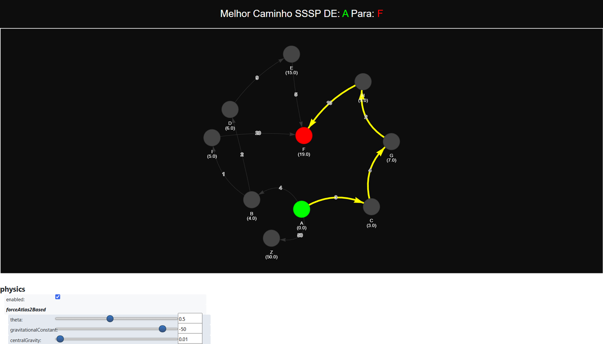

# BMSSP: Bounded Multi-Source Shortest Path (Python)

Este documento explana sobre o código utilizado para a transcrição para a linguagem Python do SSSP, um algoritmo complexo de **Caminho Mais Curto Multi-Origem Limitado (BMSSP)**.

O objetivo deste projeto é implementar o algoritmo que supera as limitações de ordenação do Dijkstra tradicional através de uma estrutura densa de lógica matemática misturada com controlo de fluxo (loops e condições).

---

## 👨‍💻 Parceiro de Programação e Créditos

**Idealização e Desenvolvimento:** Ezequias Rocha

Este código foi desenvolvido com o apoio de um **Parceiro de Programação**, com o objetivo de transformar um pseudocódigo denso num código Python seguindo os princípios de **"Uncle Bob" (Código Limpo)**:

1.  **Nomes Descritivos:** Substituição de variáveis genéricas por nomes que explicam o seu propósito.
2.  **Funções Pequenas:** Extração da lógica complexa de dentro dos loops para funções auxiliares.
3.  **Baixa Complexidade Ciclomática:** Evitar aninhamentos profundos para facilitar a manutenção.

---

## 🖼️ Visão Geral do Algoritmo

Abaixo, a imagem que exemplifica o algoritmo que supera o Dijkstra:



---

## 📂 Estrutura do Projeto

* `src/solver.py`: O coração do projeto. Contém a lógica de relaxamento de arestas e recursão por níveis.
* `src/structures.py`: Definições do Grafo (`SimpleGraph`) e da `BatchQueue`.
* `main.py`: Script para execução rápida e geração do mapa interativo.
* `tests/test_solver.py`: Central de testes automatizados que valida os cenários via JSON.
* `data/`: Cenários de teste (ex: `cenario_simples.json` e `cenario_complexo.json`).
* `output/`: Diretório onde os resultados visuais (.html) são gerados.

---

## ⚡ Performance: BMSSP vs. Dijkstra

| Característica | Dijkstra Tradicional | BMSSP (Este Projeto) |
| :--- | :--- | :--- |
| **Processamento** | Um nó de cada vez (Guloso) | Por Lotes (Batching) |
| **Gargalo** | Reordenação constante da Fila | Elimina a necessidade de ordenação total |
| **Complexidade** | $O(E + V \log V)$ | Tende a $O(E + V)$ em grafos específicos |

---

## 🧪 Como Executar e Testar

O projeto está totalmente integrado ao ambiente de testes do VS Code.

1.  **Executar o GPS Interativo:**
    ```bash
    python main.py
    ```
2.  **Executar Testes Automatizados:**
    * Abra a aba **Testing** (ícone do frasco de laboratório) no VS Code.
    * Execute os cenários listados. 
    * O sistema validará se o custo calculado bate com o `expected_cost` definido no JSON.
    * Um arquivo HTML individual será gerado na pasta `output/` para cada teste.

---

## 📊 Saída Gráfica (A Magia)

Como resultado da execução, você obterá um grafo interativo em HTML.
* **Arrastar:** Pode clicar nos nós e arrastá-los para organizar o grafo visualmente.
* **Física:** Verá os nós a "flutuar" e a ajustar as suas posições em tempo real graças ao motor de física do PyVis.

---

## 🧠 Recursos Adicionais

Este vídeo explica o contexto do avanço teórico deste paper específico (quebrar a barreira de ordenação):
[Breaking the Sorting Barrier: A New Shortest Path Breakthrough](https://www.youtube.com/watch?v=flfg0SfXkzY)

---

## 📜 Licença e Princípios

Este projeto foi desenvolvido com foco nos princípios de **Clean Code** de Robert C. Martin. Sinta-se à vontade para expandir o dicionário de dados na pasta `data/` para testar novos limites do algoritmo.